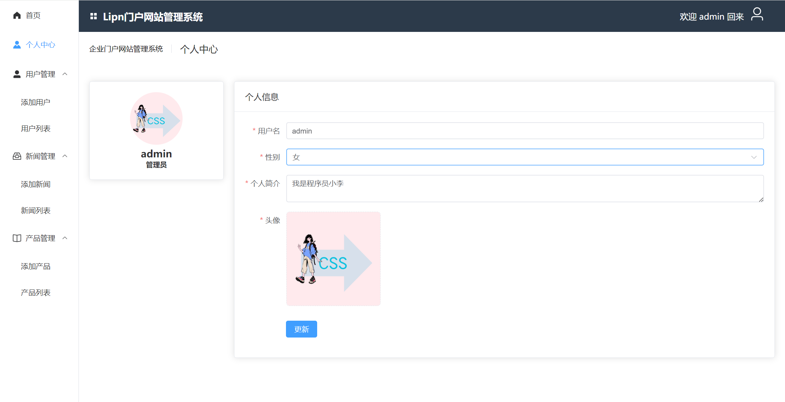

# Lipn门户后台管理系统

### 1. 项目介绍：
基于Vue3 + Vue-Router + Vuex + Element-plus 结合 wangEditor富文本编辑器实现前端页面的编写，并在登录页使用了particles粒子库为页面增加炫酷感。使用Axios库与后台建立连接，后台使用Node.js和MongoDB数据库对数据进行存储，最终实现“Lipn门户后台管理系统”与“Lipn公司门户网站”的联动。

### 2. 项目主要功能：
① 登录后台管理系统，对门户网站的数据进行增删改查。
 
② 进行权限控制，管理系统的账号分为管理员和编辑两类。
 
③ 进入个人中心对个人信息进行修改。
 
④ 用户管理-对用户的信息进行增删改查。
 
⑤ 新闻管理-对门户网站的新闻进行增删改查。
 
⑥ 产品管理-对公司的产品进行管理，并在门户网站进行展示。

### 3. 项目部分页面截图：
① 登录页

② 个人中心页面

③ 用户列表页面

④ 添加新闻页面

⑤ 新闻列表页面

### 4. 完成此项目能学习到：
① particles粒子库的配置和使用；
 
② 巩固element-plus组件的使用；
 
③ 了解wangEditor富文本编辑器的使用；
 
④ 了解MongoDB数据库与Node.js结合对数据进行管理；
 
⑤ 熟悉前后端数据通信；
 
⑥ 熟悉使用Vue-Router进行权限控制。
 
